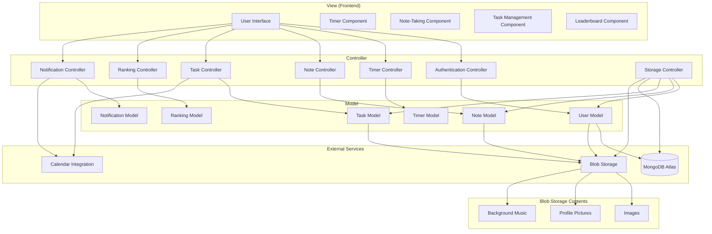

```mermaid
graph TB
    subgraph "View (Frontend)"
    UI[User Interface]
    TC[Timer Component]
    NC[Note-Taking Component]
    TM[Task Management Component]
    LB[Leaderboard Component]
    end

    subgraph "Controller"
    AC[Authentication Controller]
    TMC[Timer Controller]
    NTC[Note Controller]
    TSC[Task Controller]
    RC[Ranking Controller]
    NFC[Notification Controller]
    SC[Storage Controller]
    end

    subgraph "Model"
    UM[User Model]
    TIM[Timer Model]
    NM[Note Model]
    TSM[Task Model]
    RM[Ranking Model]
    NFM[Notification Model]
    end

    subgraph "External Services"
    CI[Calendar Integration]
    MA[(MongoDB Atlas)]
    BS[Blob Storage]
    end

    %% View to Controller
    UI --> AC
    UI --> TMC
    UI --> NTC
    UI --> TSC
    UI --> RC
    UI --> NFC

    %% Controller to Model
    AC --> UM
    TMC --> TIM
    NTC --> NM
    TSC --> TSM
    RC --> RM
    NFC --> NFM
    SC --> UM
    SC --> NM
    SC --> TSM

    %% Controller to External Services
    SC --> MA
    SC --> BS
    TSC --> CI
    NFC --> CI

    %% Model to External Services
    UM --> MA
    NM --> BS
    TSM --> BS
    UM --> BS

    subgraph "Blob Storage Contents"
    IMG[Images]
    PFP[Profile Pictures]
    BGM[Background Music]
    end

    BS --> IMG
    BS --> PFP
    BS --> BGM
```